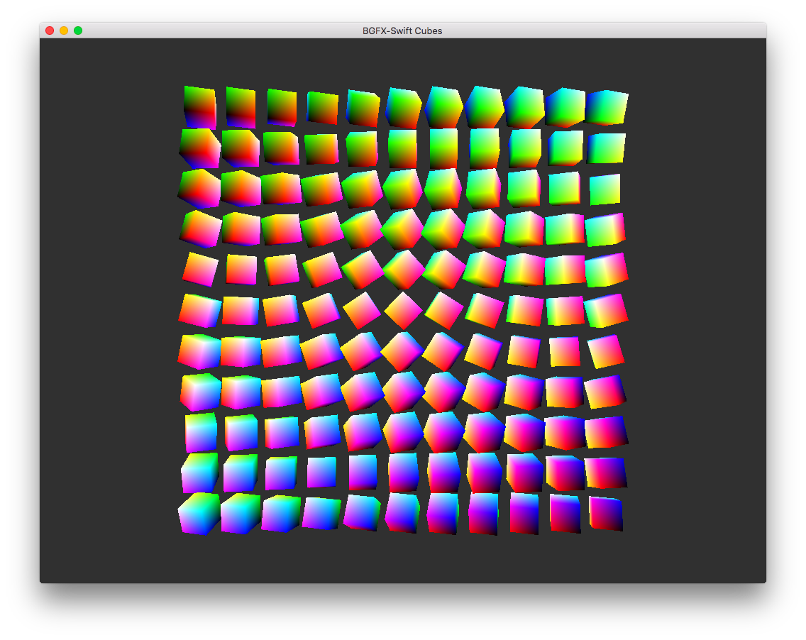

# bgfx-swift

Swift bindings for the [bgfx](https://github.com/bkaradzic/bgfx)

## Status

Just an example Mac OS X project for now, implementing one of the bgfx examples. Only initial binding necessary for the cubes example.

Testing environment: Mac OS X 10.11, Xcode 7 beta.

## Assumptions

* application code base in Swift
* as much code as possible in Swift

## TODO

* bgfx Swift binding
